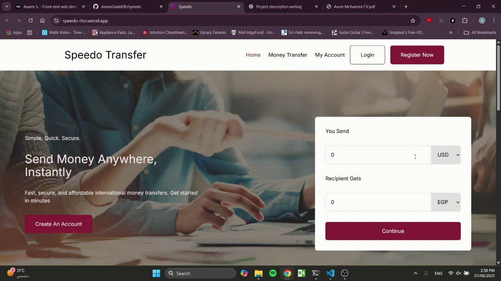
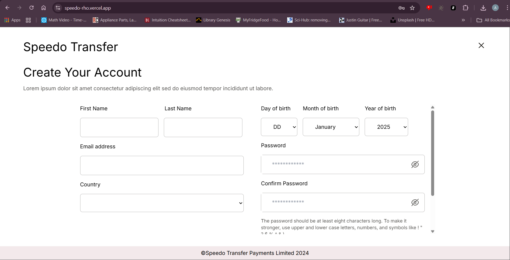
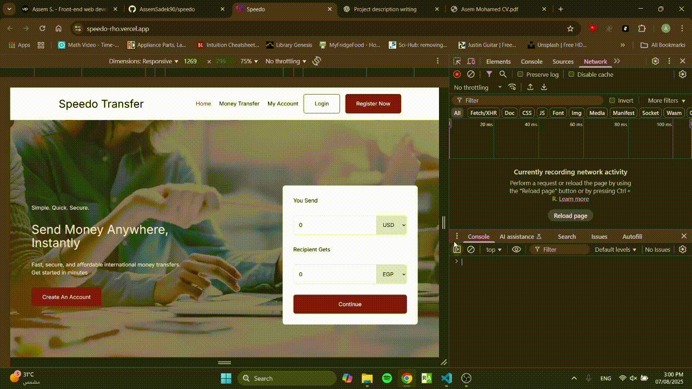

# Speedo 🚀

**Speedo** is a modern online banking web application built with **Angular**, designed to deliver a clean UI, responsive layouts, and an overall smooth user experience.  
Its purpose is to simulate core online-banking functionalities such as account overviews, balance display, transactions, and more.

[**Click here for Demo**](https://speedo-rho.vercel.app/)

---

## 📸 Demo & Screenshots

- **Landing Page Preview**  
  

- **Register Screenshot**  
  

- **Account Page Preview**  
  

- **Landing Page Responsiveness**  
  

---

## ✨ Features

- User authentication (Login / Signup)
  - Signup with password strength validators 
- Modern and clean UI built with Angular components
- Fully responsive — optimized for desktop, tablet, and mobile
- Dashboard with:
  - Account balance overview
  - Recent transactions
  - User information display
- Modular and reusable component architecture
- Easy integration with backend APIs

---

## 🧰 Tech Stack

| Layer      | Tools & Technologies                            |
|------------|--------------------------------------------------|
| Frontend   | Angular, TypeScript, HTML5, SCSS / Tailwind CSS |
| Backend    | Node.js / Express.js                            |
| Build Tool | Angular CLI                                     |
| Styling    | SCSS / Tailwind                                 |

---
## 💡 Usage Guide

After launching the project:
- Login or create an account (if signup exists)
- Access the Dashboard
- View:
  - Total balance
  - Transaction history
  - User profile info
  - Navigate through the different sections using the sidebar/menu

[**Click here for Demo**](https://speedo-rho.vercel.app/)
